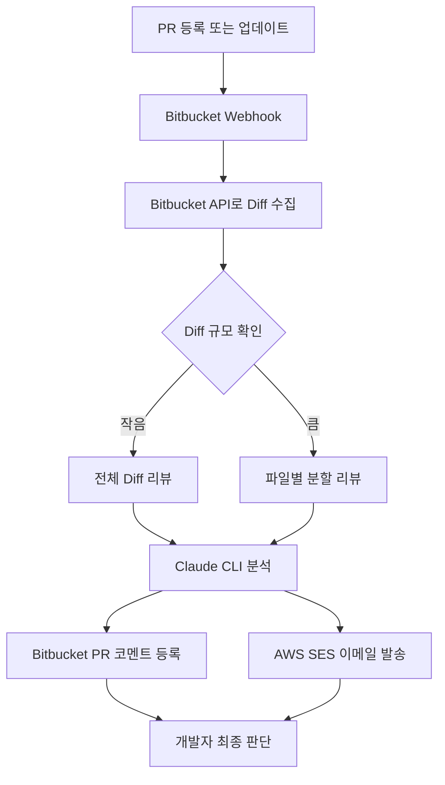
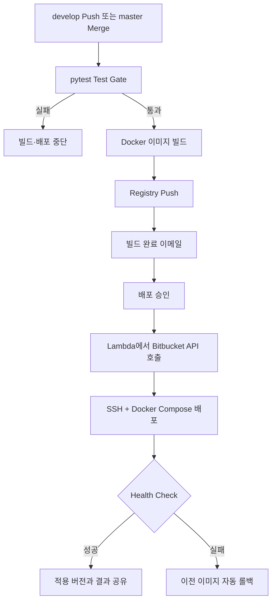

# AI 기반 코드리뷰 및 CI/CD 배포 자동화

`2026.06 - 2026.07` · 기여도 100%  
CI/CD 설계 및 개발 / AI 코드리뷰 자동화

[← 전체 프로젝트](../../README.md) · [PDF 포트폴리오](../../김용우_개발포트폴리오.pdf)

## 개요

코드리뷰, 테스트, 이미지 빌드, 배포 승인과 장애 복구를 하나의 개발 흐름으로 연결했습니다. 반복 작업은 자동화하되 AI 리뷰의 최종 반영 여부와 운영 배포 시점은 개발자가 판단하도록 구성했습니다.

| 성과 | 결과 |
| --- | --- |
| 개발자 배포 개입 시간 | 약 15분 → 약 1분 |
| AI 코드리뷰 적용 범위 | 팀 내 적용 후 타 개발팀까지 확대 |

## 문제

- 환경별 배포 스크립트를 개발자가 직접 실행
- 배포 대상과 적용 버전을 수동 확인
- 빌드·배포 결과를 직접 공유
- 장애 발생 시 이전 버전을 찾아 수동으로 재배포
- Pull Request의 변경 범위가 커지면 리뷰 부담 증가

## 담당 범위

- Claude CLI 기반 Pull Request 코드리뷰 자동화
- 리뷰 프롬프트 규칙과 Diff 분할 처리 설계
- Bitbucket Pipelines 기반 테스트·빌드·환경별 배포 구성
- AWS Lambda와 SES를 이용한 이메일 승인 및 결과 공유
- Health Check 실패 시 이전 버전 자동 롤백
- Docker 이미지 태그 기반 배포 버전 관리와 선택 버전 재배포

## AI 코드리뷰 흐름

### 리뷰 품질을 위한 처리

| 판단 지점 | 적용 방식 |
| --- | --- |
| 리뷰 범위 | 불필요한 파일을 제외하고 변경 Diff 중심으로 분석 |
| 컨텍스트 크기 | Diff 규모에 따라 전체 리뷰와 파일별 분할 리뷰 적용 |
| 프롬프트 규칙 | 근거가 부족하거나 사소한 의견을 줄이고 오류·장애 가능성·보안 이슈에 집중 |
| 전달 경로 | PR 코멘트와 이메일로 결과 전달 |

## CI/CD 흐름

## 설계 판단

| 선택 | 판단 근거 |
| --- | --- |
| 이메일 승인 배포 | 광고 운영 일정에 맞춰 사람이 배포 시점을 결정하도록 빌드와 서버 반영을 분리 |
| Lambda 기반 트리거 | 주 1~2회 수준의 배포를 위해 별도의 상시 트리거 서버를 운영하지 않음 |
| 환경·빌드 번호·시간 기반 태그 | 적용 이미지 식별과 롤백 버전 선택 지원 |
| Test Gate + Health Check | 배포 전 코드 오류와 배포 후 서비스 이상을 각각 확인 |

## 확장 방향

Diff 중심 리뷰에서 관련 소스 조회, 테스트와 정적 분석 실행까지 연결할 수 있습니다. 허용된 도구와 실행 범위, 반복 횟수를 제한한 검증 루프를 구성하면 AI 판단의 근거를 보완하면서 실행의 예측 가능성을 유지할 수 있습니다.

## 기술

`Python` · `Bitbucket Pipelines` · `Claude CLI` · `Docker` · `Docker Compose` · `AWS Lambda` · `AWS SES` · `pytest` · `Linux` · `Shell Script`

