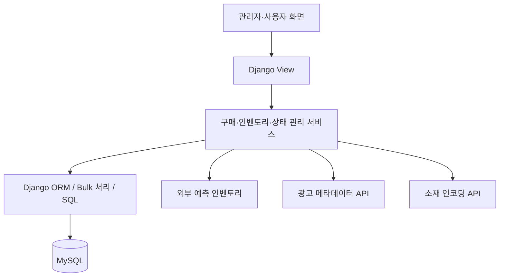
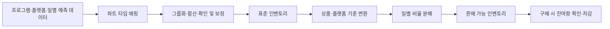
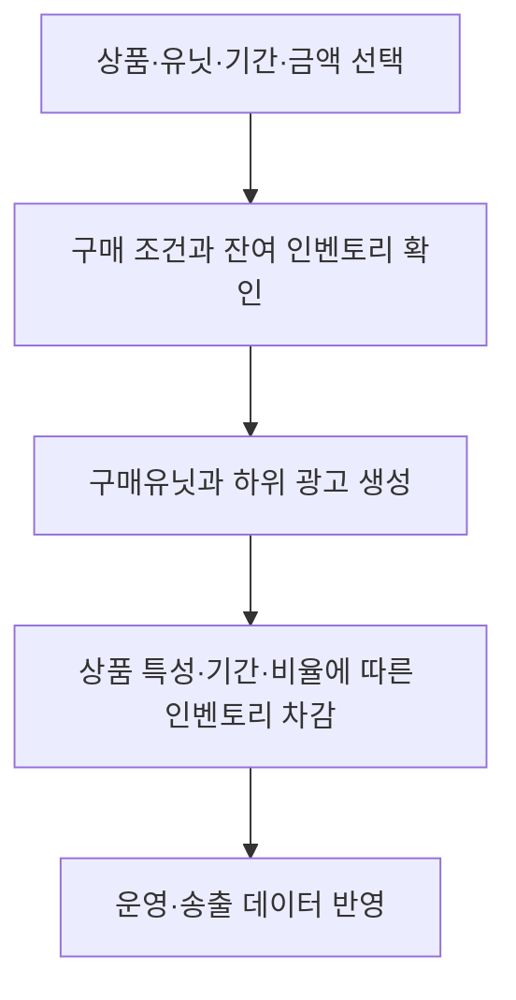
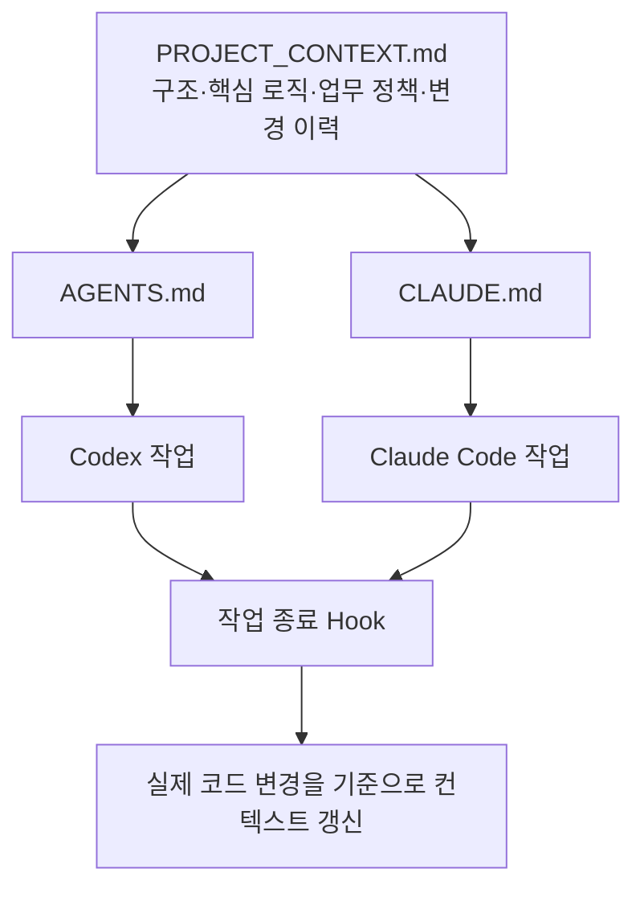

# 통합 광고 인벤토리 운영 및 광고 관리 시스템

`2025.05 - 2026.03` · 기여도 70%  
PL / 핵심 비즈니스 로직 개발

[← 전체 프로젝트](../../README.md) · [PDF 포트폴리오](../../김용우_개발포트폴리오.pdf)

## 개요

여러 광고 플랫폼에 분산된 예측 인벤토리를 통합하고 광고 구매부터 운영, 송출 연동까지 관리하는 신규 시스템을 구축했습니다. 고객 요구사항을 시스템 구조로 구체화하고 개발 일정과 작업을 조율하면서 핵심 업무 로직을 직접 개발했습니다.

| 성과 | 결과 |
| --- | --- |
| 판매 가능 인벤토리 | 기존 판매풀 대비 20% 이상 확대 |
| 역할 | 프로젝트 PL + 핵심 비즈니스 로직 개발 |

## 담당 범위

- 고객사 요구사항 정의, 개발자 간 작업 분배 및 일정 관리
- 프로젝트 구조와 주요 DB 설계
- 관리자·사용자 공통 뷰와 템플릿 구조 설계
- 외부 예측 인벤토리 가공과 판매 인벤토리 생성
- 광고 구매, 인벤토리 차감과 송출용 광고 데이터 생성
- 광고 메타데이터 및 소재 인코딩 외부 연동 API 개발
- Git/PR 규칙, 코드 컨벤션과 DB 명명 규칙 수립
- Docker 개발 환경과 Sentry 실시간 에러 모니터링 구성

## 시스템 구조

관리자와 사용자 화면에서 공통 업무 로직을 활용하고, 구매 데이터 생성과 인벤토리 변경은 서비스 계층에서 처리했습니다.

## 예측 인벤토리 변환

### 주요 처리

- 외부 분류를 내부 상품·플랫폼 기준으로 매핑
- 일별 예측 비율과 그룹 타겟팅 비중 반영
- 소수점 반올림으로 발생하는 합계 차이 보정
- Management Command, Bulk Create/Update와 SQL Upsert 활용

외부 예측값을 바로 구매에 사용하지 않고 표준화와 확인 단계를 거친 뒤 상품 기준의 판매 인벤토리로 변환했습니다.

## 구매와 인벤토리 정합성

| 문제 | 처리 |
| --- | --- |
| 일부 단계 실패 | 구매 데이터 생성과 인벤토리 변경을 하나의 트랜잭션으로 처리 |
| 분배 합계 불일치 | 금액과 목표량 분배 과정의 반올림 차이 보정 |
| 상품별 차감 기준 차이 | 상품 특성에 따라 구매 기간과 인벤토리 기준 분리 |
| 송출용 하위 데이터 필요 | 구매 정보를 기준으로 광고와 하위 운영 데이터 생성 |

## 외부 연동과 운영 기반

| 영역 | 구현 내용 |
| --- | --- |
| 광고 메타데이터 | 외부 협력사 시스템에 전달할 운영 데이터 API 설계·개발 |
| 소재 인코딩 | 인코딩 요청, 상태 동기화와 결과 콜백 처리 |
| 제안서 자동화 | 캠페인·상품 데이터를 기반으로 Excel 제안서와 타겟팅 시트 생성 |
| 모니터링 | Sentry 기반 실시간 에러 추적 |

## AI 개발 컨텍스트 관리

프로젝트 지식을 공통 관리해 AI 기반 개발의 일관성과 연속성을 높였습니다.

- Codex와 Claude Code가 동일한 프로젝트 컨텍스트 참조
- 관련 항목과 변경 이력만 최소 범위로 갱신
- 기존 내용을 임의로 삭제하거나 문서 전체를 다시 작성하지 않도록 갱신 규칙 관리

## 기술

`Python` · `Django` · `MySQL` · `JavaScript` · `jQuery` · `Docker` · `AWS EC2` · `AWS S3` · `Route53` · `Sentry` · `openpyxl`

