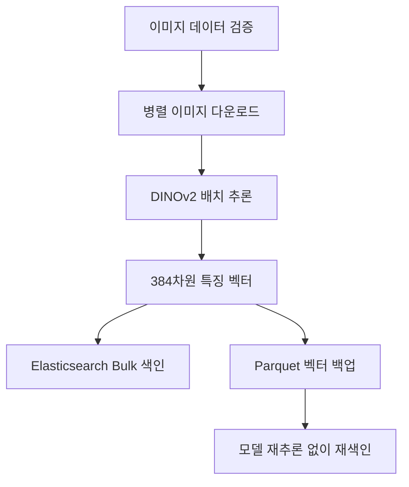
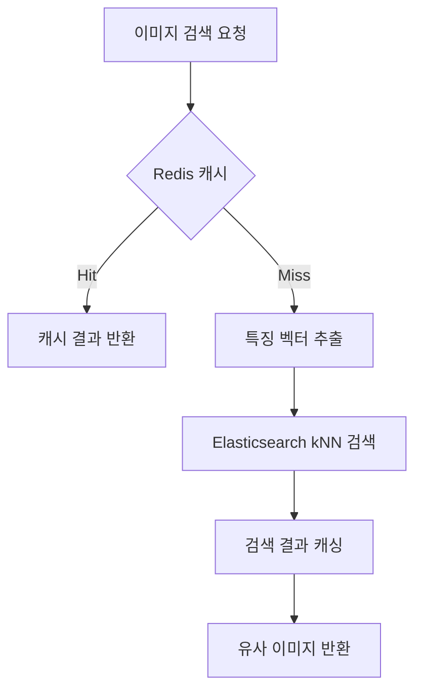

# AI 모델 기반 이미지 유사도 검색 PoC

`2026.04 - 2026.05` · 기여도 100%  
AI 검색 시스템 설계 / 백엔드 개발

[← 전체 프로젝트](../../README.md) · [PDF 포트폴리오](../../김용우_개발포트폴리오.pdf)

## 개요

이미지를 벡터화하고 유사 이미지를 검색하는 백엔드 구조를 검증했습니다. 특징 추출부터 벡터 색인, 검색 API까지 연결하고 검색 품질, 메모리 사용과 응답시간을 함께 고려해 구성을 결정했습니다.

| 검증 결과 | 범위 |
| --- | --- |
| 벡터 메모리 약 75% 절감 | float32 대비 int8 벡터 값의 저장 크기 기준 |
| 검색 응답시간 100ms 이내 | PoC 환경에서 확인한 결과 |

## 담당 범위

- DINOv2 기반 이미지 특징 벡터 추출 파이프라인
- FastAPI와 Elasticsearch kNN 기반 검색 API
- HNSW 기반 근사 최근접 이웃 검색 적용
- int8 양자화와 Redis 캐싱
- Parquet 기반 벡터 백업·재색인
- Circuit Breaker를 통한 검색 엔진 장애 전파 제한

## 기술 선택

### DINOv2

이미지 특징 추출 모델을 조사하고 실제 검색 결과의 시각적 유사성을 정성적으로 확인했습니다. 모델의 인지도만으로 결정하지 않고 목적에 맞는 검색 결과, 처리 비용과 메모리 사용을 함께 고려해 DINOv2를 선택했습니다.

### HNSW 기반 kNN

전체 벡터를 순차 비교하는 계산 부담을 줄이고 유사한 후보를 빠르게 찾기 위해 Elasticsearch의 HNSW 기반 kNN 검색을 적용했습니다.

### int8 양자화와 Redis

int8 양자화로 벡터 저장 메모리를 줄이고 Redis에 동일 검색 결과를 캐싱했습니다. 양자화에 따른 정밀도 손실 가능성과 자원 절감 효과를 함께 확인했습니다.

## 색인 파이프라인

특징 추출 결과를 Parquet으로 보존해 인덱스를 다시 구성할 때 이미지 다운로드와 모델 추론을 반복하지 않도록 했습니다.

## 검색 API와 장애 대응

Circuit Breaker는 검색 엔진 상태에 따라 다음과 같이 동작합니다.

| 상태 | 동작 |
| --- | --- |
| CLOSED | 검색 엔진을 정상 호출 |
| OPEN | 반복 호출을 차단하고 캐시 또는 빈 결과 반환 |
| HALF_OPEN | 시험 요청으로 정상 응답 여부 확인 |

## 확장 방향

현재 PoC는 이미지 벡터 검색까지 구현했습니다. 이미지와 연결된 설명, 카테고리와 업무 문서를 함께 색인하면 이미지 유사도와 텍스트 조건을 결합한 멀티모달 검색으로 확장할 수 있습니다. 검색 결과를 근거 컨텍스트로 제공하고 검색 적합성과 답변의 근거 충실도를 분리 평가하는 RAG 구조도 검토할 수 있습니다.

## 기술

`Python` · `FastAPI` · `DINOv2` · `Elasticsearch` · `kNN` · `HNSW` · `Redis` · `Parquet` · `Docker Compose`

