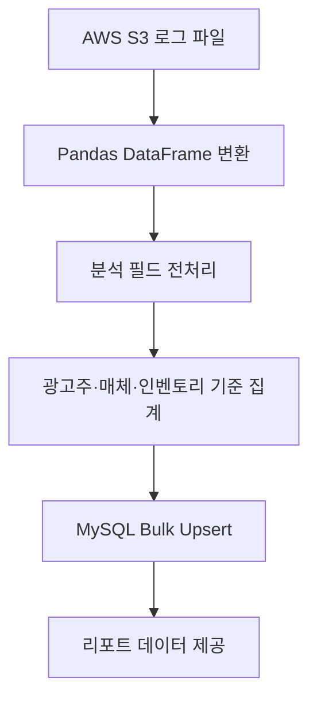
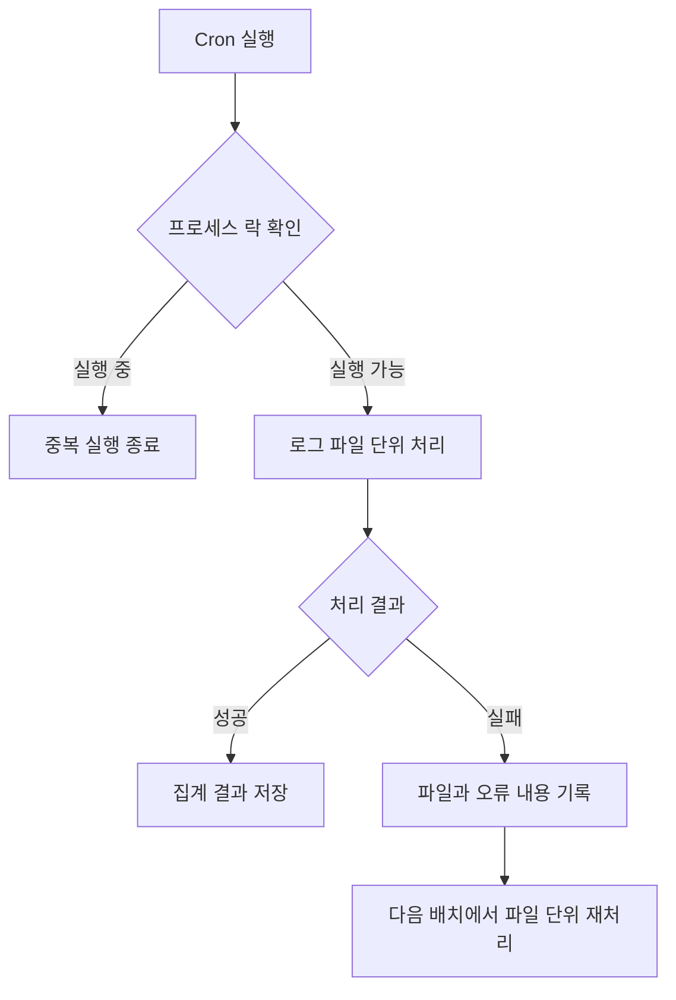

# 대용량 광고 로그 분석 시스템

`2024.03 - 2024.05` · 기여도 100%  
데이터 처리 파이프라인 설계 / 백엔드 개발

[← 전체 프로젝트](../../README.md) · [PDF 포트폴리오](../../김용우_개발포트폴리오.pdf)

## 개요

광고 요청, 노출과 클릭 로그를 수집·가공·분석해 광고 성과와 운영 상태를 확인하는 리포트 데이터를 생성했습니다. 기존 Perl 기반 분석기를 Python/Pandas 기반으로 재개발하고 대량 데이터 처리와 배치 운영 방식을 개선했습니다.

| 성과 | 결과 |
| --- | --- |
| 로그 처리 규모 | AWS S3 기준 일 10GB 이상 |
| 분석 처리속도 | 기존 대비 30~40% 개선 |

## 담당 범위

- AWS S3 로그 데이터 수집과 전처리 파이프라인
- Pandas 기반 데이터 가공과 지표 집계
- 광고주·매체·인벤토리 등 다중 리포트 생성
- 벡터화 연산과 MySQL Bulk Upsert 적용
- 실패 파일의 다음 배치 재처리
- 프로세스 락과 Linux Cron 기반 배치 자동화

## 처리 흐름

## 처리속도 개선

| 적용 방식 | 목적 |
| --- | --- |
| Pandas 벡터화 연산 | 반복문 중심 가공을 배열 연산 중심으로 변경 |
| Bulk Upsert | 집계 결과를 여러 건씩 묶어 DB에 반영 |
| 파일 단위 배치 | 대량 로그의 처리 범위와 실패 단위를 관리 |

## 실패 기록과 재처리

- 프로세스 락으로 분석 작업의 중복 실행 방지
- 실패한 파일과 에러 내용을 기록해 처리 문제 확인
- 다음 배치에서 실패 파일을 다시 처리할 수 있는 복구 흐름 구성

## 기술

`Python` · `Pandas` · `PyMySQL` · `MySQL` · `AWS S3` · `Docker` · `Linux Cron`

